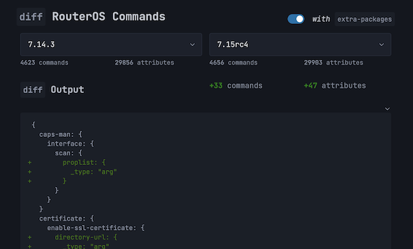

# RouterOS REST API "Schema Tools"

## <mark>NEW</mark> — `diff` RouterOS Commands

The project web site has an [`diff` tool]((https://tikoci.github.io/restraml)) that compares the output of `/console/inspect` between RouterOS Versions.

[](https://tikoci.github.io/restraml)

## Download

Pre-build schema files for RouterOS REST API are available on this project's website at
https://tikoci.github.io/restraml

> [!TIP]
> File an issue in this project, if you'd like a specific version built.

Included are three files:
 * `RAML` - schema in RAML 1.0 format, used in tools like Postman
 * `HTML` - documentation, generated from the schema
 * `JSON` - intermediate raw data from RouterOS's `/console/inspect` in JSON format, for use with data analytics.

## Usage with Postman
For detailed instructions on using the RAML schema with Postman, see this forum article:
https://forum.mikrotik.com/viewtopic.php?p=1041886

> [!WARNING]
> Ironically, the RouterOS schema uncovered a bug in the most recent version of Postman that does not allow **directly** importing a RAML schema. Postman is working on a fix. Any existing loaded schema still works. Postman version 11.0.12 _and below_ work fine`. 
>
To import this schema into Postman App 11.1.14 _or greater_, the RAML schema must be **indirectly** as an "API", and then from API creating a collection from the API - rather than directly importing the RAML, see [raml1-to-postman issue #84](
https://github.com/postmanlabs/raml1-to-postman/issues/84#issuecomment-2125114449)
showing the process, including a video of the process.

> [!TIP] 
> ### What about OpenAPI?
> The RAML schema can be converted to an OpenAPI schema ("OAS").  Right now, it a manual process.  You can use any RAML from [Downloads](https://tikoci.github.io/restraml), then paste that into MuleSoft's online converter here:
>
> https://mulesoft.github.io/oas-raml-converter
>
> It _should_ produce a OAS 2.0 schema usable in the latest Postman via import, and other tool.  While OpenAPI schemas are more wildly supported, RAML is used as base schema here since it's easier to generate programatically.
> _Automated RAML->OAS convertion is "planned" — comment in [#4 Issue](https://github.com/tikoci/restraml/issues/4) if this would be useful to you._

## Build
### Generating the RAML file

1. Install [Bun](https://bun.sh/)
2. Clone this repository
3. Install `js-yaml`: 
 `bun install js-yaml`
4. Run `rest2raml.js` like so:
 ```sh
 URLBASE=https://<IP or DNS name>/rest BASICAUTH=<user>:<pass> bun rest2raml.js
 # Example:
 URLBASE=https://192.168.88.1/rest BASICAUTH=admin:h3llow0rld bun rest2raml.js
 ```
 Wait a while for this code to run. It could take as long as an hour to process the entire schema.
5. Open a pull request to add the RAML file to this repository if it's missing 😉

### Generating the HTML page

1. Follow steps 1-2 above, or 1-4 if this repository doesn't currently contain a RAML file for your RouterOS version.
2. Install `raml2html` and `raml2html-slate-theme`: 
 `bun install raml2html raml2html-slate-theme`
3. Generate the HTML page with `raml2html`:
 ```sh
 raml2html --theme raml2html-slate-theme <RAML file> > <HTML file>
 # Example:
 raml2html --theme raml2html-slate-theme ros-rest-all.raml > ros-rest.all.html
 ```

## Implementation

### Schema Generation
The schema generation is done via JavaScript, specifically using `bun`, in `rest2raml.js`. The code connects to RouterOS via REST API, to use the `/console/inspect` command to traverse the "AST" for RouterOS config. The results of this intermediate phase are stored in an `inspect.json`, as retrieved from the router. With the inspect.json, `rest2raml.js` then builds that data into a RAML schema for API tools. 

> [!WARNING]
> **The generated schema is more for convenience than validation.** Generation is limited to the data available from `/console/inspect`, and what's reasonable to deduce. So there is not perfect fidelity between schema and API. For example, while there are _required_ and _optional_ parameters, all parameters are marked as optional in the schema. As a result, all attributes are generally shown - while using all of them is likely to be invalid. 

### GitHub 

#### Actions

GitHub Actions is used to build the schema published on this project's website:
 * [Builds](https://github.com/tikoci/restraml/actions/workflows/manual-using-docker-in-docker.yaml) for `manual-from-docker-in-docker.yaml` [Workflow](https://github.com/tikoci/restraml/blob/main/.github/workflows/manual-using-docker-in-docker.yaml) - start a RouterOS CHR (via docker-compose and QEMU) **within the build**, and then `rest2raml.js` uses the "internal" CHR to generate the schema, without any external resources needed.
 * [Builds](https://github.com/tikoci/restraml/actions/workflows/manual-from-secrets.yaml) for `manual-from-secrets.yaml` [Workflow](https://github.com/tikoci/restraml/blob/main/.github/workflows/manual-from-secrets.yaml) - uses GitHub Secret with information to connection to a RouterOS device on internet


> [!NOTE] 
> Both actions use only `workflow_dispatch`, so new generation is **still manually triggered** by providing a version on the Action page in GitHub. Only the repo owner can do this. 


#### Pages 
The website for the project - with downloadable schemas – is from the `/docs` directory in repo.