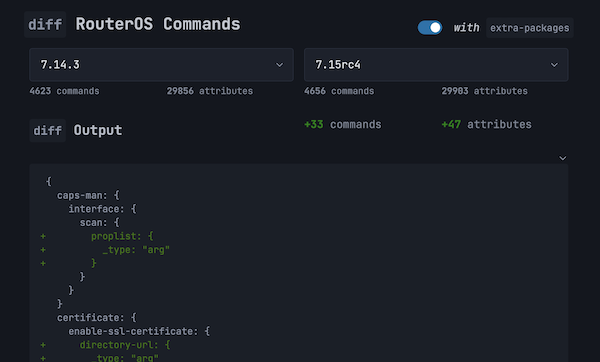

# RouterOS API Schema Tools

> **[tikoci.github.io/restraml](https://tikoci.github.io/restraml)** — schema downloads, side-by-side version diffs, a command lookup tool, and a browser-based `/app` YAML editor for the MikroTik RouterOS REST API. No install needed, runs in your browser.
>
> For RouterOS 7.22+: JSON Schema files for `/app` container YAML are also published there, ready to plug into VSCode — [setup details below](#using-the-app-yaml-schema-in-vscode).

Auto-generated API schemas for the [MikroTik RouterOS](https://mikrotik.com/) REST API, built automatically by [GitHub Actions](https://github.com/tikoci/restraml/actions) — you can watch the sausage being made.

[](https://tikoci.github.io/restraml)

## Download Schemas

Pre-built schema files for the RouterOS REST API are available at
<https://tikoci.github.io/restraml>

> [!TIP]
> Missing a version? Need a feature? Spot a bug? [Open an issue](https://github.com/tikoci/restraml/issues/new/choose) — builds run automatically for new RouterOS releases via [GitHub Actions](https://github.com/tikoci/restraml/actions), and requests are welcome.

Each RouterOS version includes:

* **RAML** — RAML 1.0 schema, usable in [Postman](#usage-with-postman), MuleSoft, and other API tools
* **HTML** — human-readable API documentation generated from the schema
* **JSON** — raw `/console/inspect` output from RouterOS, useful for data analysis and diffs
* **MIB** — link to the official MikroTik MIB for SNMP

There may be a _base_ and _+extra_ download for each version:

* **base** — just the `routeros.npk` system package
* **+extra** — all x86 packages: `routeros`, `dude`, `container`, `rose-storage`, `gps`, `lora`, `calea`, `user-manager`, `ups`, `iot`, `wifiwave2`, `tr069-client`

### `diff` RouterOS Commands

The [project website](https://tikoci.github.io/restraml) includes a **diff tool** that compares the `/console/inspect` output between any two RouterOS versions — useful for tracking new commands, removed attributes, and API changes across releases.

### `lookup` RouterOS Commands

A **command lookup tool** at [tikoci.github.io/restraml/lookup.html](https://tikoci.github.io/restraml/lookup.html) lets you search RouterOS commands and attributes across versions, with filtering by path and attribute name.

### `/app` YAML Editor

A **browser-based YAML editor** at [tikoci.github.io/restraml/tikapp.html](https://tikoci.github.io/restraml/tikapp.html) lets you write and validate RouterOS `/app` YAML directly in your browser using Monaco editor (the same editor that powers VS Code). Features include:

* Schema validation against any versioned schema (7.22+) or the latest schema
* Built-in examples from MikroTik's app library, filterable by category
* Dirty-state tracking — edit examples safely with Stash / Recall / Discard workflow
* `app-store-urls=` toggle that auto-converts single app ↔ array format
* Custom YAML autosaved to browser local storage (restored on reload)
* Support for both single `/app` definitions and `app-store-urls=` array format
* Download as `.tikapp.yaml` / `.tikappstore.yaml`, or copy YAML to clipboard
* Copy directly as a RouterOS `/app add yaml=` command
* Shareable URLs — version, schema mode, and YAML content encoded on explicit Share

📖 **[Full user manual →](https://tikoci.github.io/restraml/tikapp-manual.html)**

---

## RouterOS `/app` YAML Schema

RouterOS 7.22+ includes [`/app`](https://help.mikrotik.com/docs/spaces/ROS/pages/268664833/) — a YAML format (similar to `docker-compose` but RouterOS-specific) for defining custom container applications. This project provides **JSON Schema** files to validate `/app` YAML in editors like VSCode.

### Schema URLs

| Schema | URL | Purpose |
| --- | --- | --- |
| Single `/app` | [`routeros-app-yaml-schema.latest.json`](https://tikoci.github.io/restraml/routeros-app-yaml-schema.latest.json) | Validates a single `/app` YAML definition |
| App Store | [`routeros-app-yaml-store-schema.latest.json`](https://tikoci.github.io/restraml/routeros-app-yaml-store-schema.latest.json) | Validates the array format used by `/app/settings`'s `app-store-urls=` |
| Per-version | `https://tikoci.github.io/restraml/{version}/routeros-app-yaml-schema.json` | Version-specific schema (available for 7.22+) |

Per-version schemas are automatically validated against MikroTik's built-in `/app` entries for each new RouterOS release to verify accuracy.

> [!NOTE]
> Each schema build boots a RouterOS CHR in QEMU directly on a GitHub Actions runner (with KVM acceleration), installs extra packages, then validates all ~80 built-in `/app` YAMLs from the live router against the schema. See [appyamlschemas.yaml](.github/workflows/appyamlschemas.yaml) for the workflow.

### Using the `/app` YAML Schema in VSCode

Install the [Red Hat YAML extension](https://marketplace.visualstudio.com/items?itemName=redhat.vscode-yaml) for VSCode, then use either approach:

#### Option 1: Inline schema comment (per-file)

Add a `yaml-language-server` comment at the top of your YAML file. The YAML extension will detect it automatically — no settings changes needed.

For a **single `/app` definition**:

```yaml
# yaml-language-server: $schema=https://tikoci.github.io/restraml/routeros-app-yaml-schema.latest.json

name: my-app
descr: My custom RouterOS app
services:
  server:
    image: myimage:latest
    ports:
      - 8080:80:web
```

For an **app store** file (array of `/app` definitions, used with `app-store-urls=`):

```yaml
# yaml-language-server: $schema=https://tikoci.github.io/restraml/routeros-app-yaml-store-schema.latest.json

- name: app-one
  services:
    server:
      image: app1:latest
- name: app-two
  services:
    server:
      image: app2:latest
```

#### Option 2: VSCode settings (automatic for matching filenames)

Add to your `.vscode/settings.json` to apply the schema automatically to any file whose name matches the glob pattern. **Files must be named using the configured ending** (e.g. `my-app.tikapp.yaml` for a single `/app` definition, or `my-store.tikappstore.yaml` for a store file):

```json
{
  "yaml.schemas": {
    "https://tikoci.github.io/restraml/routeros-app-yaml-schema.latest.json": "*.tikapp.yaml",
    "https://tikoci.github.io/restraml/routeros-app-yaml-store-schema.latest.json": "*.tikappstore.yaml"
  }
}
```

> [!TIP]
> You can also use a version-specific schema URL (e.g., `.../7.22/routeros-app-yaml-schema.json`) if you need validation matched to a particular RouterOS release.

---

## Usage with Postman

The RAML 1.0 schema can be imported into [Postman](https://www.postman.com/) ([download here](https://www.postman.com/downloads/)) to explore the RouterOS REST API:

1. Copy the URL of the version-specific RAML file from the [Schema Downloads](https://tikoci.github.io/restraml/#section-schema-downloads) table (right-click the **base** or **+extra** link under RAML)
2. In Postman, go to **File** → **Import** and paste the URL
3. On the next screen, select **Postman Collection** — note this may take several minutes for the full schema

> [!WARNING]
> The generated schema is more for convenience than strict validation. Generation is limited to the data available from `/console/inspect`. For example, all parameters are marked as optional in the schema even though some are required in practice.

---

## Repository Layout

```text
restraml/
├── rest2raml.js              # Main script: RouterOS REST API → RAML 1.0
├── validraml.cjs             # RAML 1.0 validator
├── appyamlvalidate.js        # /app YAML schema validator (Bun)
├── Dockerfile.chr-qemu       # Local dev: RouterOS CHR in QEMU via Docker
├── scripts/
│   └── entrypoint.sh         # QEMU launcher for local Docker use
├── docs/                     # GitHub Pages root (one subdirectory per version)
│   ├── index.html            # Main website: version list, diff tool, downloads
│   ├── routeros-app-yaml-schema.latest.json
│   ├── routeros-app-yaml-store-schema.latest.json
│   └── {version}/            # Per-version schemas and docs
├── CLAUDE.md                 # Full architecture guide for AI agents
├── AGENTS.md                 # GitHub Copilot agent instructions
└── .github/workflows/
    ├── auto.yaml             # Daily cron: detect new versions, trigger builds
    ├── manual-using-docker-in-docker.yaml
    ├── manual-using-extra-docker-in-docker.yaml
    ├── appyamlschemas.yaml   # Validate and publish /app YAML schemas
    └── manual-from-secrets.yaml
```

---

## Architecture & Development

For full architecture details, CI/CD pipeline documentation, and development instructions, see:

* [CLAUDE.md](CLAUDE.md) — comprehensive architecture guide
* [AGENTS.md](AGENTS.md) — GitHub Copilot agent instructions
